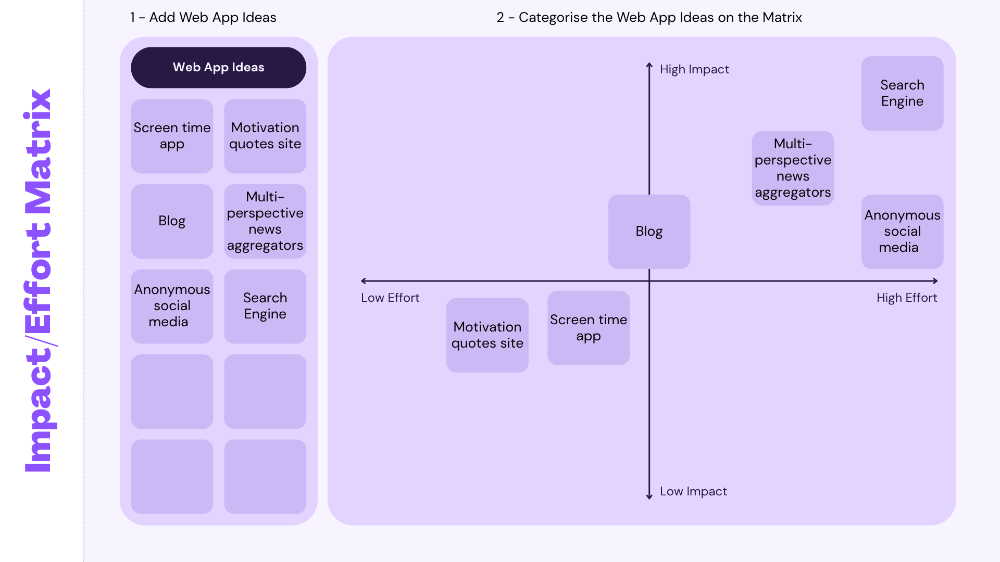
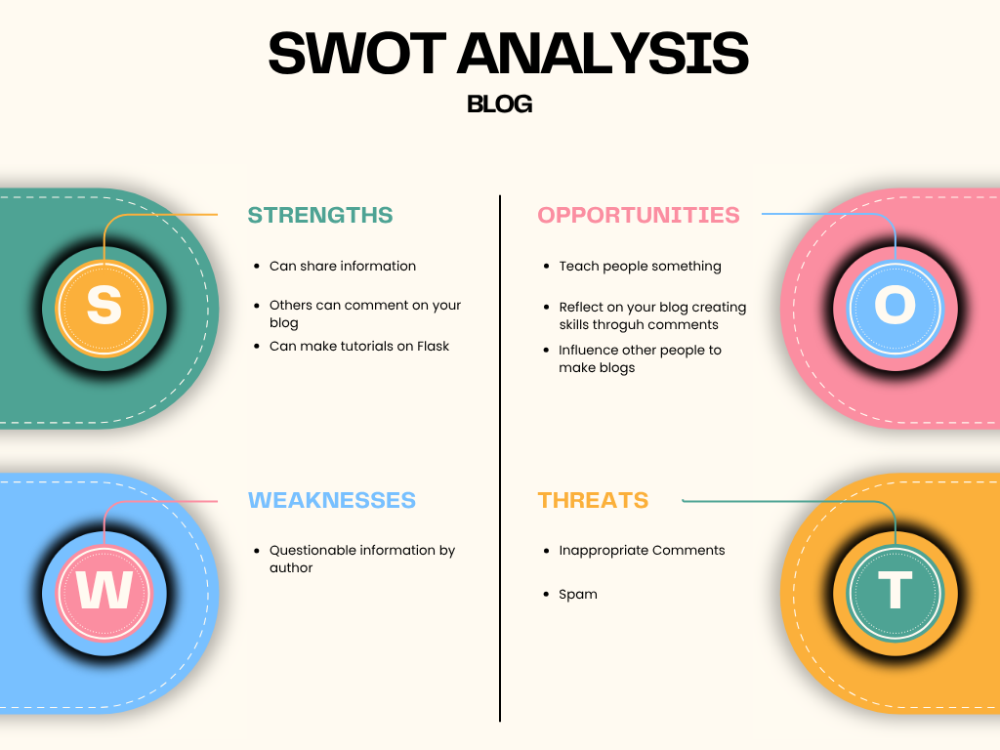

# 10CT2 Task 2 Web Apps - Project Documentation

## Identifying and Defining
Divergent Mindmaps on Excalidraw

Brainstorming

| Idea name                          | What it does                                                               | Influence it explores | Who it helps                                   |
| ---------------------------------- | -------------------------------------------------------------------------- | --------------------- | ---------------------------------------------- |
| Screen time app                    | Limits your screentime by locking down your device after a set time period | Social Media          | Someone who has social media addiction         |
| Motivational quotes site           | Displays a different motivational quote everyday                           | Society               | Unmotivated people                             |
| Blog                               | Website that has blogs or posts uploaded                                   | Information           | People seeking information or opinion          |
| Multi-perspective news aggregators | Collects news and articles and sorts them by different "perspectives"      | Information           | Anyone looking for an unbiased source          |
| Anonymous social media             | Social media without the ability to have profiles or accounts              | Social Media          | People who dislike conformity and want privacy |
| Search Engine                      | A site to search up other sites                                            | Information           | People seeking information or opinion          |

Impact Effort Matrix

SWOT Analysis

Reflection
